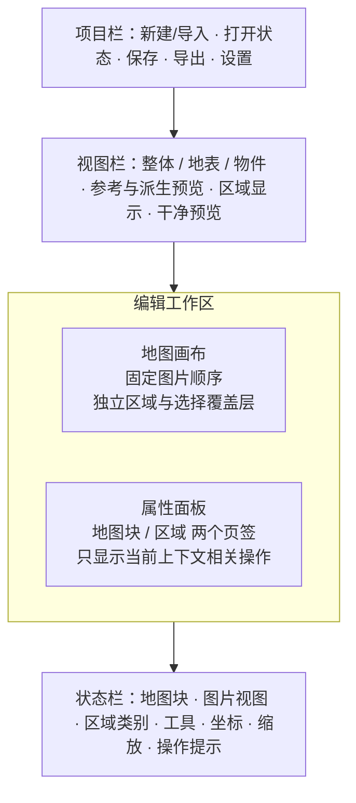

# 地图拼接前端修复方案

> 历史快照：本文保留修复前问题、当时行号和实施目标，不再作为当前产品规范。当前行为见 [地图编辑器](map-stitcher.md)，当前模块边界见 [地图拼接架构](MAP_STITCHER_ARCHITECTURE.md)。

实施说明：以下问题表与行号保留为修复前的审查记录。三阶段实现、回归证据和剩余验证边界记录在 [修复验收](MAP_STITCHER_REPAIR_VERIFICATION.md)，当前操作说明见 [地图编辑器](map-stitcher.md)。

本方案针对当前主入口 `/tools/map-stitcher`，以本轮读取的工作区代码为依据，对照 [FrameRonin 线上地图拼接工具](https://frameronin.com/) 的可观察功能。Unity 不在范围内。保留现有 Pixelwork 状态兼容、Godot 导出、图片精修和 Agent 接口。

建议先修复会导致误操作、数据误删和预览失真的行为，再整理界面，最后补齐参考站的生产流程。图片视图维持单选，区域标注作为独立覆盖层；不把完整图、地表、物件和黑白参考图混成一个默认全部叠加的图层栈。

本文保留方案审查阶段的记录。下文的交互问题和“本轮”均指修复前的代码审查；实施后的代码、浏览器验证和测试结果以文首链接的修复验收记录为准。

## 1. 现有问题与修复落点

文件简称：`Editor` = `components/map-stitcher/frame-ronin-map-editor.tsx`；`Overlay` = `components/map-stitcher/region-drawing-overlay.tsx`。行号对应本轮读取版本。

| 优先级 | 问题及影响 | 当前代码证据 | 修复要求 |
| --- | --- | --- | --- |
| P0 | 点击区域后，选中状态可能立即丢失 | `Overlay:201` 在 `pointerdown` 选中区域，仅阻止该事件冒泡；外层卡片 `Editor:1276` 的 `click` 无条件清除区域选择 | 把图片、卡片选择控件、区域输入面分开；区域手势结束不能再触发卡片选择。明确区分“选卡片”和“选区域” |
| P0 | 平移和绘制能同时响应同一次手势 | `Overlay:111` 不检查鼠标按键；`Editor:1296` 的交互条件不排除平移；父级 `Editor:723` 又为中键、右键、空格和平移模式捕获指针 | 先判定手势归属，只有左键绘制；平移期间暂停区域输入。处理 `pointercancel`、失去捕获和窗口失焦 |
| P0 | 锁定只是局部按钮限制，不能可靠保护内容 | 图片精修、删除、流水线分别在 `Editor:789/768/614`，缺少统一锁检查；`Overlay:201` 可以命中其他区域类别，`deleteRegion:680` 不检查目标锁 | 所有写入动作检查实际目标的锁。覆盖上传、删除、精修提交、流水线、区域创建/删除/清空及 Agent 调用；异步结果落盘前重新检查 |
| P0 | 看见的区域范围和清空范围不一致 | `Overlay:56` 按 `tileKey + mapLayer` 过滤；`Editor:318/687` 计数与清空只按 `tileKey + 区域类别` | 显示、命中、计数和清空共用作用域选择器。“清空当前范围”只清空面板明确显示的范围；清空全部另设明确入口 |
| P0 | 自由绘制看见的是线，生效的却是闭合面 | `region-engine.ts:79` 的自由路径不闭合；`Overlay:197` 不填充；`layer-engine.ts:229` 对合法自由路径执行闭合填充，Godot 碰撞也按多边形导出 | 将区域的“自由绘制”明确为自由套索：提交后闭合、填充，与扣除和碰撞一致。保留原始点数据；不能静默改变旧包的实际生效几何 |
| P1 | 图片“眼睛”暗示多层合成，实际只控制当前单视图 | `Editor:1259/1281` 只取 `activeMapLayer` 一张图片；`Editor:1338` 却为五个非整体层同时显示眼睛；整体层没有对应显隐/锁定入口 | 主图片改为单选视图；原图/黑白参考/派生 Mask 分组。区域保留眼睛。临时隐藏底图用一个明确的全局预览控件 |
| P1 | 物件层与 Mask 的缓存容易串用或出现过期预览 | `processedLayerUrls` 只以 `tile.key` 索引；`Editor:632` 异步重建，`Editor:1259` 在切换时立即读取旧表；清理会撤销仍被状态引用的 URL | 缓存键至少包含卡片、视图、图片版本和区域版本；取消旧请求后拒收结果；新图就绪后替换并释放旧图；显示局部处理中状态 |
| P1 | 选中或悬停卡片会改变真实地图的遮盖顺序 | `map-editor.css:154/155` 提升整张卡片的 `z-index`；`layer-engine.ts:211` 按卡片数组顺序导出 | 图片顺序稳定，与导出顺序一致；选中边框、手柄和操作按钮放到独立 UI 覆盖层，只提升这些控件 |
| P1 | 绘制草稿、编辑模式与历史记录缺少统一生命周期 | 草稿存于各 `Overlay`；退出绘制或换卡片未显式清除；`Editor:703` 将 `Ctrl+Shift+Z` 也识别为撤销；重做栈只有写入，没有重做动作 | 草稿绑定编辑会话；换项目、换卡片、退出编辑或打开精修时明确取消。补充重做，撤销先处理草稿，再处理已提交区域 |
| P1 | “图层流水线完成”容易被理解为已完成真实场景分层 | `Editor:556` 将整体图复制为地表，并在整体图下铺黑/白底；不透明原图会盖住底色，两张参考相同，物件提取仍得整张不透明图 | 区分“复制整体图”“由已有透明物件生成黑白底”“从真实黑白参考提取物件”。实际语义分层完成前不显示成功分层状态 |
| P1 | 窄窗口会直接丢失核心图层入口 | 旧 CSS 在 `map-editor.css:318` 把侧栏压成 48px，`:328` 隐藏图层面板；新区域面板继续受同一套样式影响 | 新编辑器使用独立布局作用域。窄屏改为抽屉/可展开面板，所有图层和区域操作保持可访问；常用文字提升至可读字号 |
| P1 | 文档与主入口不是同一套模型 | 主路由加载 `FrameRoninMapEditor`；`docs/map-stitcher.md` 仍包含 SceneMaker v5、矩形碰撞及旧 Godot 场景说明 | 以主入口和当前代码更新用户文档；旧版说明单独归档，迁移说明保留 |

P0 为首批阻断问题；P1 紧随其后。以上不是单纯样式调整，必须同时处理事件、状态和输出语义。

## 2. 与参考站对齐的边界

本轮直接打开了 FrameRonin V4.3 的地图模块、帮助和设置，并切换了物件视图。以下“已观察”指页面公开控件与说明，不代表已执行付费生成或完成引擎运行验收。

| 能力 | 参考站本轮证据 | 本地现状与安排 |
| --- | --- | --- |
| 图片视图 | 主视图单选：整体、地表、物件；另有黑、白参考视图 | 保持这种选择关系。已有 Mask 移入“派生预览”，不做普通可编辑图片 |
| 导入与卡片管理 | 导入、单块上传/生成/卸载，帮助明确区分卡片操作 | 保留现有功能；明确“新建地图”和“上传到当前卡片”，拖入图片时显示目标 |
| 扩图布局 | 细分扩图、横纵独立重叠比例 | 保留当前 4/8/12 块能力；修改重叠比例仅影响新扩展时给出提示 |
| 干净预览 | 隐藏操作卡片，保留地图内容 | 区分隐藏卡片 UI、隐藏边框、隐藏区域标注、是否导出内容，避免一个“隐藏”承担多种意义 |
| 批量生成 | 可设置同时生成数量；有全自动扩图、生成所有物件入口 | 本地只有单块操作与单块流水线。后续补有上限的队列、暂停/取消、失败重试和目标范围 |
| 资源保护 | 设置说明以内存阈值暂停自动扩图 | 本地显示的是资源体积估算，状态包内保护字段没有对应运行机制；后续按解码像素估算并实装阈值 |
| 文件输出 | 全部 PNG、PSD、保存状态、Godot 包 | 本地有当前 PNG、Top PNG、PSD、Pixelwork 状态和 Godot；统一导出入口并补明确的批量 PNG |
| Godot 恢复 | 有“加载 Godot”入口，说明支持 ZIP 或 manifest | 当前主加载器只识别 Pixelwork v1/v2 和 SceneMaker v5；需要补当前主模型的 Godot 导入，不能以旧页面支持代替 |
| 生成设置 | API 模式、图片比例、分辨率、提取设置可见 | 保留已有服务端密钥隔离。新增参数必须先确认实际连接器支持，再同步 Manifest 和接口；不直接照搬参考站下拉项 |
| 区域编辑细节 | 本轮未进行带素材的参考站区域交互实测 | 以本地四类区域和 Pixelwork 兼容为约束；矩形手势、自由路径闭合、跨视图显示等细节列入后续对照实测，不宣称完全一致 |

参考网站的界面和功能可能更新。每个新增能力以可复现操作和状态包样本作为验收依据，而不是只核对按钮名称。

## 3. 推荐界面结构

### 图片视图

- 用分段单选控制“看哪张图”：整体、地表、物件。黑底、白底和 Mask 收进“参考与派生预览”。
- 图片视图显示可用数量，例如“地表 3/9”。当前卡片缺少该图时，明确提示缺什么、可以上传还是派生；不能只呈现空白。
- 图片编辑锁放到属性面板，标明当前锁是“此图片类型的全部卡片”还是单卡片；首轮保持已有全局图片类型锁语义。
- Mask 只读，显示其来源与缺少的依赖。整体层也有明确的锁状态和底图预览控制。
- 另提供“导出效果预览”，使用与 Godot 相同的整体/分离合成选择规则，并显示 Top。该功能与单图片检查视图区分，避免重复叠加整体图。

### 区域面板

- 行名称改为“碰撞区域、遮挡扣除区域、调整区域、顶层区域”，避免与图片层混淆。每行显示颜色、数量、可见性、锁定和当前编辑目标。
- 推荐默认保持当前 Pixelwork 的所属视图关系：`mapLayer` 保留，不改写历史状态。增加“当前视图 / 当前卡片全部视图”的显示范围；切视图时提示还有多少区域属于其他视图。
- 默认仅当前卡片、当前区域类别可编辑，其余区域只作参考。跨视图参考区域可定位回所属视图，避免直接改写作者归属。
- 区域显隐只控制辅助标注；遮挡扣除、碰撞和 Top 的生效状态不受眼睛影响。若需要禁用区域效果，后续用独立的“参与输出”字段，不能借用显隐字段。
- 计数、区域列表、命中和“清空当前范围”共享作用域。清空按钮明确写出数量和范围，例如“清空本卡片·整体视图的 3 个碰撞区域”。
- 点击矩形、多边形或自由套索就进入对应工具，取消当前“选工具后还要再点进入”的双重状态；有缺失前提时就地解释。

### 绘制与选择规则

| 操作 | 推荐行为 |
| --- | --- |
| 选择 | 点击图形稳定选中；点击空白取消区域选择；卡片选择有独立入口 |
| 矩形 | 首轮保留当前两次点击，显示起点、终点提示与完成/取消入口；参考站带素材实测后再决定是否补拖拽模式 |
| 多边形 | 点击加点，`Enter/C` 或完成按钮闭合；草稿中 `Backspace` 撤销一个顶点；避免双击结束时追加重复点 |
| 自由套索 | 左键按住拖动，松开闭合为区域；预览显示将闭合的轮廓和填充。点数、面积与自交无效时解释原因 |
| 平移 | 中键/右键/空格+左键为临时平移；恢复后继续原工具。平移过程不产生顶点、选择或删除 |
| Esc | 有草稿时先取消草稿；否则取消选中；再次退出区域编辑。一次按键只完成一层动作 |
| 删除 | 仅删除明确选中、属于当前编辑范围且未锁定的区域；输入框和弹窗内不响应画布删除 |
| 撤销/重做 | `Ctrl/Cmd+Z` 撤销，`Ctrl/Cmd+Shift+Z` 重做；按钮显示可操作状态；新操作清空重做分支 |

像素精修保留独立编辑器。打开时暂停地图快捷键和区域草稿，提交时重新检查目标图片及锁状态，取消时恢复先前地图上下文。

### 地图块属性与布局

“地图块”页签只放当前卡片的图片、上传/生成、扩展和羽化。“区域”页签只放区域类型、工具、列表和所选区域属性。导出、状态保存和 API 设置移到项目栏，避免右侧堆叠几十个常驻按钮。

桌面保持大画布与可收起属性栏；中等窗口允许面板收起；窄窗口使用抽屉，不隐藏必需功能。控件滚动属于控件，画布滚轮缩放只在画布上生效。常用标签建议 14px，次要信息 12px，减少当前 9–11px 的高密度文字。

## 4. 状态、事件与渲染的实施约束

先抽取公共动作和选择器，再拆页面，避免同时重写算法和 UI。

| 状态域 | 内容 | 约束 |
| --- | --- | --- |
| 地图文档 | 卡片几何、图片引用、羽化、区域 | 只有此域产生持久内容修改；保持原始输入资产可恢复 |
| 视图状态 | 当前图片视图、区域显示范围、显隐、缩放、平移、卡片 UI | 改变视图不删除或移动文档内容；不意外改变输出 |
| 编辑会话 | `navigate / region / pixel`，目标卡片、区域类别、工具、草稿 | 模式互斥；临时平移是当前模式下的手势状态；换项目时整体失效 |
| 选择 | 无选择 / 卡片选择 / 区域选择 | 校验所选对象存在且符合当前范围；不能由父子事件各维护一套选择 |
| 历史 | 已提交操作的撤销与重做 | 首轮补齐区域历史；图片替换、羽化和卡片变更在后续阶段纳入可恢复操作 |
| 派生缓存 | 渲染图片、Mask、导出预览 | 由文档版本派生，不作为可编辑源图片；过期异步结果不能覆盖新状态 |

建议新增模块，名称可在实施时细化：

- `features/map-stitcher/editor-state.ts`：状态、动作、编辑会话与有效性约束。
- `features/map-stitcher/editor-selectors.ts`：区域范围、可编辑目标、数量、图片就绪状态。
- `components/map-stitcher/use-map-editor-controller.ts`：按钮、快捷键与 WebMCP 共用动作入口。
- `components/map-stitcher/canvas/`：画布手势路由、稳定图片渲染层、区域层和选择装饰层。
- `components/map-stitcher/panels/`：图片视图选择、卡片属性、区域工具与列表。

`frame-ronin-map-editor.tsx` 最终只负责组合这些模块。`region-engine.ts` 和 `layer-engine.ts` 继续负责几何及图像处理，Workbench Shell 不接收这些算法。

必须保持的行为约束：

1. 一个指针手势只能属于平移、绘制或选择之一；UI 面板与画布有独立事件边界。
2. 在动作执行入口检查锁和范围，并在异步提交时检查目标文档版本；仅禁用按钮不够。
3. 已锁定对象允许查看和选中检查，禁止直接修改。撤销/重做作为明确的历史恢复动作处理，不与普通删除混用。
4. 隐藏标注不代表停用区域；隐藏卡片 UI 不代表排除图片；现有 `tile.hidden` 的导出排除语义必须显式呈现。
5. 区域显示范围可以按所属视图过滤，但遮挡等生效范围由区域类型定义。物件出现扣除时，面板应能定位来自其他视图的相关区域。
6. 自由区域、矩形和多边形由同一规范几何生成 SVG、命中范围、图片扣除与 Godot 碰撞。明确处理零面积、自交及非法坐标。
7. 保存仍兼容 Pixelwork v2；新增 UI 偏好放在 `workbench` 扩展内。恢复时校验所选对象，并重置草稿、指针、弹窗和过期任务。
8. 改动能力或连接器参数时，`workbench/manifest.json` 是唯一能力契约来源；Web、CLI、MCP 同步调整。密钥继续留在服务端。

## 5. 分阶段实施与完成标准

| 阶段 | 改动范围 | 交付标准 |
| --- | --- | --- |
| 第一阶段：修复 P0 | 区域/卡片事件隔离、指针归属、目标锁检查、计数与清空范围、自由套索语义、草稿取消、重做 | 画得出、选得住、删得准；平移不落笔；锁定不可绕过；所见几何与输出一致 |
| 第二阶段：整理界面与状态 | 图片单选分组、区域/卡片页签、动作与状态抽取、快捷键作用域、缓存修复、稳定绘制顺序、窄屏布局 | 用户始终能判断当前视图、编辑对象和工具；快速切层无串图；悬停/选择不改变地图像素 |
| 第三阶段：补齐生产闭环 | 真实分层状态表达、受控批量队列、并发/内存上限、全部 PNG、Godot 恢复、导出效果预览、文档更新 | 对照参考站逐项演示已支持的流程；未实现的生成能力明确标示，不能用占位结果冒充完成 |

各阶段独立提交，先让核心交互可靠，再叠加复杂能力。旧版入口保留为迁移回退，验收通过前不删除；Unity 不恢复，也不列入验收。

第三阶段中，真实语义分层需要有效的分层输入或支持该能力的外部服务。当前连接器只承诺整体层生成，不能仅靠前端改按钮完成。建议先交付“手动上传地表/黑白参考 → 提取物件 → 派生 Mask”的可靠路径，再扩展服务契约。

## 6. 必须覆盖的验收案例

| 场景 | 预期结果 |
| --- | --- |
| 两张重叠卡片，分别悬停和选择 | 图片遮盖顺序固定，导出与预览一致 |
| 点击某个碰撞区域，再点击工具栏 | 区域保持选中，删除和属性操作目标明确 |
| 矩形/多边形/自由工具下中键、右键或空格平移 | 只有画布移动，没有新增区域或顶点 |
| 输入框中按 Delete、Backspace、C、Enter、Ctrl+Z | 只影响输入或当前弹窗，不误操作地图 |
| 锁住图片后上传、精修、删除、流水线或 Agent 修改 | 全部入口阻止修改并解释锁定对象；任务完成前加锁也能阻止旧结果覆盖 |
| 锁住碰撞区域，切到遮挡工具再尝试删除该碰撞 | 仍然受目标区域锁保护 |
| 同卡片不同图片视图各有碰撞区域，清空当前范围 | 仅删除明确显示的范围，计数、列表、导出剩余区域一致 |
| 隐藏区域辅助标注后保存、导出 | 标注不可见，但既有遮挡/碰撞/Top 生效语义不变 |
| 画自由套索并导出遮挡/Top/Godot | 闭合边界和填充范围一致，无“线变面” |
| 快速切换物件与 Mask，期间修改区域或替换图片 | 不显示另一视图缓存，不加载已释放 URL，旧请求不能覆盖新预览 |
| 画到一半换卡片、关闭编辑、导入新项目或失焦 | 无幽灵草稿、错误归属或持续平移；提示符合约定 |
| 新建、删除、清空区域后撤销/重做 | 内容和选择一致恢复；新操作后重做分支失效 |
| 不透明整图运行本地分层相关操作 | 明确标识复制/参考生成结果，不宣称得到独立透明物件 |
| Pixelwork v1/v2、SceneMaker v5 与新增扩展字段往返 | 卡片、图片、区域坐标、所属视图及兼容字段不丢失 |
| 主界面在 1440、1024、680px 及以下宽度使用 | 图层切换、区域工具和项目保存始终可访问；面板滚动不缩放地图 |
| 队列执行中取消、达到内存阈值、生成失败 | 停止新增调度、保留已完成内容、明确失败目标，允许重试 |
| Godot 包重新加载 | 按包实际保存的信息恢复；缺失原始卡片/作者状态时明确降级信息，不宣称完整往返 |

测试安排：几何、作用域、锁定动作、历史、缓存版本用针对行为的单元测试；事件冒泡、快捷键、指针捕获和响应式入口用浏览器回归验证。使用纯几何测试图片与小状态包，避免依赖外部图片生成来证明编辑功能正确。

实施后运行 `npm run test:map-stitcher`、`npm run lint`、`npm run build`，并按改动补充类型检查。涉及 Manifest/连接器时运行 `npm run workbench -- doctor --json`；涉及共享运行时或 Agent 桥接时运行 `npm run test:mcp` 及相应 adapters/HTTP 测试。

## 7. 方案审查阶段的验证记录（修复前）

- 已核对主路由、编辑组件、区域覆盖层、几何、渲染、状态包、Godot 导出及相关 CSS；主页面使用 FrameRonin 模型，旧页面是独立入口。
- 已通过项目 MCP 执行能力列举和 `map-stitcher` 描述查询，确认当前能力及外部生成仅支持整体层。没有创建生产任务，因此没有生成任务 ID 或地图产物。
- `npm run test:map-stitcher`：9 项通过。现有用例集中于类型、几何、matte 算法、状态解析与世界坐标，不能证明前端事件正确。
- 直接调用现有函数验证：自由路径 `(10,10) → (50,10) → (50,50)` 的 SVG 没有闭合命令，而图片路径执行 `closePath` 和 `fill`，确认两条渲染路径语义不同。
- 直接调用现有 matte 函数验证：黑白输入均为 `[48,96,144]` 时，输出 `[48,96,144,255]`；结合本地对不透明整体图铺底的实现，可以确认这类输入无法产生独立透明物件。
- 参考站仅验证公开控件和说明；区域详细手势、复杂状态包兼容、外部生成质量及 Godot 引擎运行尚未实测。
- 本轮新增本方案文件；未修改应用实现、现有状态包或 Unity 删除结果。
