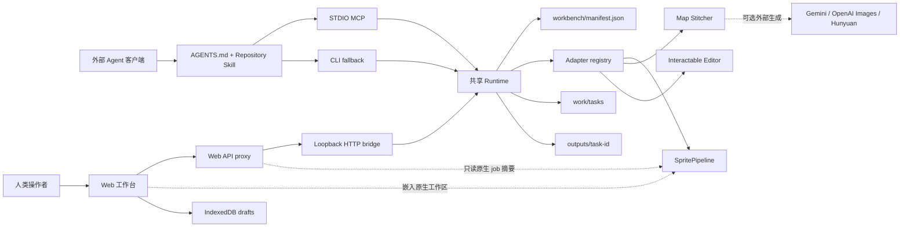

# 系统架构

## 1. 架构目标

Forge 是一个“外部 Agent 驱动、Web 工作台协作、能力可插拔”的本地优先项目。Codex、WorkBuddy 或其他支持 MCP 的客户端是主 Agent；仓库中的 Web 应用不内置大语言模型，也不承担意图规划。

架构需要同时保证：

- Agent 能仅通过项目指令、MCP 或 CLI 发现并调用能力。
- 人可以在统一界面查看任务、调整图形参数、预览和导出不适合纯对话完成的内容。
- 能力实现可独立演进；工作台只维护清单、协议、任务状态和适配器。
- 本地任务、输入与产物有明确边界，密钥不进入浏览器存储、任务和产物；专用服务配置可以受保护地持久保存。

## 2. 总体结构

MCP、CLI 和 Web 在允许的能力范围内汇入同一套运行时，因此不应各自实现一份能力目录或任务规则。Web 仍保留页面内编辑、浏览器草稿、嵌入式 SpritePipeline UI 和只读原生 job 摘要；这些状态必须与 runtime task 明确区分。

## 3. 分层与职责

| 层 | 主要位置 | 职责 |
| --- | --- | --- |
| 项目指令 | `AGENTS.md`、`.agents/skills/` | 告诉外部 Agent 何时选能力、何时只准备、何时可执行 |
| 能力清单 | `workbench/manifest.json` | 定义能力 ID、输入 schema、输出、适配器、页面路由与工作流引用 |
| 接入层 | `scripts/workbench-mcp.mjs`、`scripts/workbench.mjs`、`scripts/workbench-http.mjs` | 分别提供 STDIO MCP、命令行和回环 HTTP 接口 |
| 共享运行时 | `lib/workbench/runtime.mjs` | 加载与校验清单、创建任务、调度适配器、持久化与恢复状态 |
| 能力适配器 | `lib/workbench/adapters/` | 把统一任务请求转换为工具实现或外部 API 请求 |
| Web 应用 | `app/`、`components/workbench/`、`features/` | 任务监控、参数编辑、人工交互、预览和下载 |
| 工具实现 | `Tools/` 与能力模块 | 承载具体算法或独立服务，不把算法复制进工作台壳层 |
| 数据层 | `work/`、`outputs/`、浏览器 IndexedDB | 分离任务记录、生成产物与本机浏览器草稿 |

## 4. 单一能力来源

`workbench/manifest.json` 是工作台级能力目录。以下内容必须从它读取，而不能在 MCP、CLI 或 Web 中另建常量表：

- 能力 ID、名称、状态、说明和页面路由；
- 输入 JSON Schema、必填字段和示例；
- 连接器类型、适配器名称和所需环境变量；
- 声明的产物类型；
- 工作流阶段与关联文档。

交互物项目 schema 体量较大，采用生成式同步：`features/interactable-editor/contract.mjs` 是其字段定义编辑源，`npm run schema:interactable` 将其同步到清单。同步后必须检查 manifest diff，并运行工作台 doctor 与交互物测试。

## 5. 四项生产能力

### 5.0 角色原图

`reference-art` 通过 Node 适配器调用 SpritePipeline 中的窄接口，共用服务实例的受保护 PixelLab Key。Pixflux 后台任务 ID 记录在 runtime task 中；get/status 只查询原任务，完成后校验 128×128 透明 PNG 并写入任务产物。`transfer` 根据已完成源任务创建可复用角色预设，序列帧界面通过角色链接预选参考图，不生成动画。详见 [角色原图](reference-art.md)。

### 5.1 序列帧生成

`sprite-generator` 通过本地适配器连接 `Tools/SpritePipeline`。开发总控默认在回环地址启动或复用 SpritePipeline，并支持创建任务、开始生成、查询和导出。远端生成是异步的；重复查询只刷新已有上游任务，不会重新提交一次生成。

### 5.2 地图拼接

`map-stitcher` 的确定性拼接、状态恢复、区域标注与导出在本地完成。`generate-origin` 从提示词生成中心图，预览采用后再编辑；`generate-layer` 扩展已有透明模板。两者可按配置调用 Gemini、OpenAI Images 或混元 Image 3.0，外部生成不是本地拼接的前置条件。地图仅供手动前端制作，MCP 排除其发现与执行；Agent 不得用其他接口绕过。模板中 alpha 大于 0 的像素必须被保留，生成内容只填充完全透明区域。

### 5.3 独立交互物编辑

`interactable-editor` 在本地校验项目并导出 Godot 4.6.x 资源。当前支持 inspect、toggle、pickup、sequence 四类对象，以及 proximity_press、pointer_click、automatic_enter、external_request 四类触发方式。导出不要求本机安装 Godot，也不调用外部生成 API。

## 6. Agent 调用面

仓库级 STDIO MCP 暴露只读资源 `workbench://manifest` 和 16 个工具。基础任务工具为：

1. `workbench_list_capabilities`：读取当前能力目录。
2. `workbench_describe_capability`：读取目标能力 schema、连接器和输出契约。
3. `workbench_prepare_task`：仅校验并持久化任务，不运行能力。
4. `workbench_run_task`：校验后运行清单选定的本地适配器。
5. `workbench_get_task`：读取任务；对于运行中的异步任务，安全刷新同一个上游作业一次。

另有环境、Sprite 服务启动、前端启动、预设、交互物模板、历史、结果、图片读取及三个资产目录工具。共用 `lib/workbench/agent-api.mjs`，完整名单见 [Agent 客户端接入](agent-clients.md)。工程 Skill 是外部 Agent 文件工作流，不额外增加 MCP 工具。

CLI 的 `list`、`describe`、`prepare`、`run`、`status` 与上述语义对齐。浏览器页面还可以在宿主支持 `document.modelContext` 时注册页面级工具；它们只代表当前页面的交互能力，不替代仓库 STDIO MCP。

## 7. 任务生命周期

运行时按任务建立 `work/tasks/<task-id>.json`，并为产物预留 `outputs/<task-id>/`。主要状态为：

- `prepared`：输入已校验，但尚未执行。
- `running`：适配器或已有上游异步任务仍在处理。
- `awaiting_configuration`：所需外部服务未配置；这不是完成状态。
- `attention_required`：作业已保存或需要检查/恢复，读取实际候选和下一步。
- `completed`：本次操作返回成功，声明产物已验证并记录；保存或检查完成不等于动画已导出。
- `failed`：执行失败，任务记录包含可报告的错误。

运行时只接纳位于该任务输出目录内的生成文件，防止适配器把任意本地路径伪装成产物。输入资源保持不变，新文件写入任务专属目录。

## 8. Web 工作台与本地状态

Web 工作台提供生产台、场景台、专业工具和高级配置。它负责：

- 合并展示运行时任务、SpritePipeline 原生任务与浏览器草稿；
- 在离开或替换编辑会话前保存草稿，并在繁忙或未保存时提示；
- 提供画布、图层、锚点、区域等需要直接操作的编辑器；
- 显示真实状态和产物，不伪装成内置 Agent 对话。

浏览器草稿存于 IndexedDB 数据库 `workbench-production-v1`，不等同于 `work/tasks` 中的可审计任务记录。部署后的静态或托管页面也不能自然访问开发者电脑上的 `127.0.0.1` 服务；若需要远程使用，必须单独部署经过认证与访问控制的运行时桥接。

## 9. 启动与服务拓扑

`npm run dev` 是本地完整开发入口：

- Web 应用默认监听 `http://localhost:3000`；
- 工作台 HTTP bridge 默认监听 `http://127.0.0.1:8790`；
- SpritePipeline 默认监听 `http://127.0.0.1:7860`，健康时复用，否则由总控托管；
- 当 `SPRITE_PIPELINE_API_URL` 指向非默认或非回环服务时，总控不会接管该进程。

`npm run dev:interactable` 不启动 SpritePipeline，适合只开发本地交互物编辑器。其他拆分命令见 [开发与验证](development.md)。

## 10. 安全边界

- API token 从服务端环境或专用配置读取。设置入口接收用户输入后不回显；不写入浏览器存储、任务 JSON、日志或提交文件。
- HTTP bridge 和默认工具服务仅监听回环地址。
- 所有本地源文件和产物路径必须解析并验证在允许的工作区或任务目录内。
- 外部调用可能产生费用或数据出站；必须先有执行授权。讨论不创建任务，明确的输入校验才使用 `prepare`。
- Web 上传由服务端接收并写入受控任务位置；当前交互物资源单文件上限 64 MB，源项目导入上限 256 MB。

## 11. 扩展原则

新增能力时，应先实现独立适配器和清单条目，再让 MCP、CLI 与 Web 自动消费。若需要外部 API，应把认证、重试、错误归一化和输出验证留在服务端适配器；浏览器只获得完成任务所需的非敏感状态。完整步骤见 [开发与验证](development.md)。

## 场景组装的网页边界

场景组装在 Manifest 的 `editorModules` 注册网页入口，复用模块导航而不加入 `capabilities` 可执行契约。网页编辑和源包保存在浏览器，私有导出路由通过 loopback Runtime Bridge 复用交互物生成器并装配地图、物件及碰撞。导出结果写入 `outputs/scene-export-<id>/`，记录写入 `work/scene-exports/`；这些记录与 Agent 任务区分。素材没有自动同步或场景内行为编辑。详见[场景组装](scene-composer.md)。

## 资产与工程交接

`asset-catalog.mjs` 按来源身份合并任务产物与原生候选，并从 manifest 的 sceneExportDirectory 收录完整场景导出；浏览器草稿不自动收录。场景保留每次导出的独立版本与两个 ZIP，不冒充生产任务。执行历史归档与资产可见性分离，资产保留创建时间和来源记录；历史搜索先过滤全量未归档记录，再按快照分页。清单描述资产，下载 ZIP 才交付文件。Sprite 导出同时提供 PNG 和单动作 Godot SpriteFrames 包，旧记录保留可选字段兼容。工程 Skill 优先消费现成包；它在授权目标项目按 CopyWorms 契约接入角色与地图，保留玩法计时、场景生命周期和第三方依赖。详见 [资产目录](asset-catalog.md) 与 [游戏工程](game-engineering.md)。

完整地图工程通过人工编辑器保存到 `workspace.mapProjectDirectory`，源 ZIP 位于版本化 outputs 目录，IndexedDB 保留本地备份。持久化独立于生产任务，资产库 map 类型仅索引完整工程。协议、冲突恢复和源包格式见 [地图工具](map-stitcher.md)；`npm run test:map-stitcher` 包含完整源包往返、并发版本冲突及文件完整性检查。

地图源包可带可选的 `preview.png`。Bridge 验证 PNG 像素与尺寸，作为同版本的显示附件保存；失败不阻断源包记录提交。资产预览接口校验工程版本和附件哈希，不调用合成器或图片服务。浏览器缓存只依赖地图文档中的画面数据。

### 资产回收站

`asset-trash.mjs` 在 manifest 指定的独立索引保存稳定资产 ID、别名和移入时摘要，使用跨进程目录锁与原子替换。`asset-catalog.mjs` 在扫描后合并回收站状态，默认只列 active，来源离线时仍提供可恢复的摘要。Web manage 代理和 Bridge 共享同一管理函数，不改源文件、不新建任务；MCP 查询继续只读。
